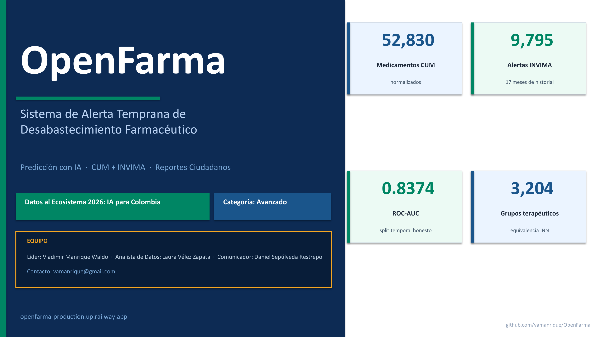
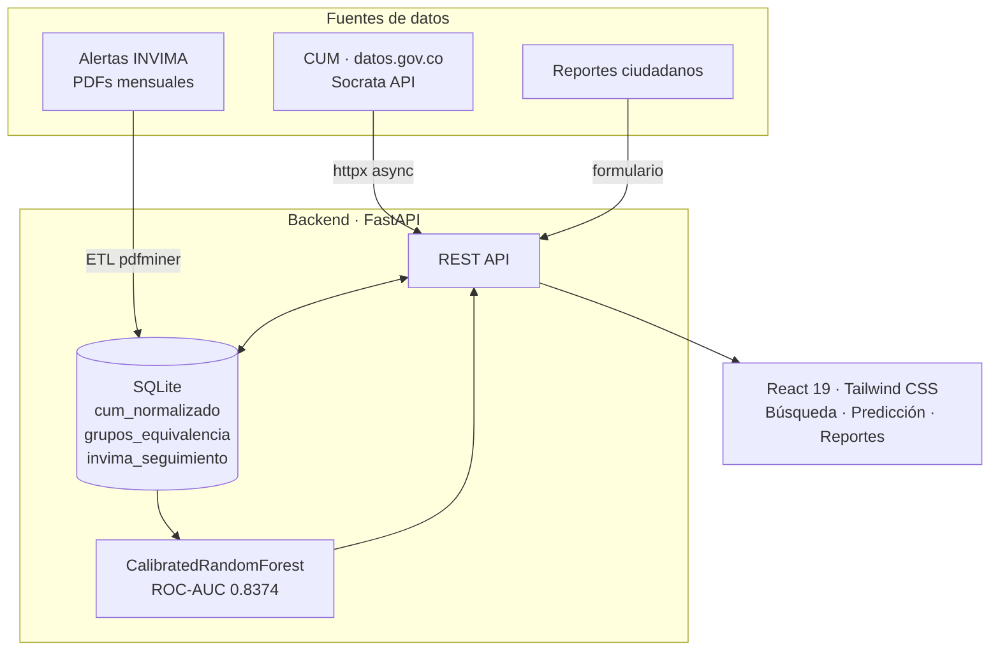
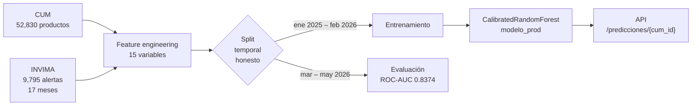

# OpenFarma — Sistema de Alerta Temprana de Desabastecimiento Farmacéutico

**Nivel:** Avanzado · **Concurso:** Datos al Ecosistema 2026 · **datos.gov.co**

> Plataforma de inteligencia farmacéutica que combina datos abiertos del CUM, historial de alertas del INVIMA y reportes ciudadanos para predecir y alertar sobre el desabastecimiento de medicamentos en Colombia antes de que ocurra.



---

## Problema

El desabastecimiento de medicamentos afecta a millones de pacientes colombianos cada año. Las alertas del INVIMA llegan tarde — cuando el problema ya es crítico. No existe un sistema público que integre señales tempranas (variaciones en el mercado, historial de alertas, reportes ciudadanos) para anticipar escasez.

**OpenFarma** resuelve esto con tres componentes:
1. **Búsqueda inteligente** del Catálogo Único de Medicamentos (CUM) en tiempo real
2. **Modelo predictivo** de desabastecimiento con ROC-AUC 0.8374
3. **Canal ciudadano** de reporte de no disponibilidad → alimenta el modelo

---

## Datos Utilizados

| Dataset | Fuente | Registros |
|---------|--------|-----------|
| Catálogo Único de Medicamentos (CUM) activos | [datos.gov.co · i7cb-raxc](https://www.datos.gov.co/resource/i7cb-raxc.json) | ~52,000 presentaciones |
| CUM — Registros en trámite de renovación | [datos.gov.co · vgr4-gemg](https://www.datos.gov.co/resource/vgr4-gemg.json) | ~8,000 registros |
| Historial de alertas INVIMA (PDF) | Portal INVIMA | 17 meses, 9,795 entradas (ene 2025 – may 2026) |
| Reportes ciudadanos | OpenFarma (formulario propio) | En crecimiento |

---

## Arquitectura



**Flujo de búsqueda:**
1. El usuario escribe un medicamento → consulta en tiempo real a datos.gov.co (CUM activo + renovación)
2. Si Socrata no responde → fallback local en `cum_normalizado` (52,830 productos)
3. Enriquecimiento con grupos de equivalencia → alternativas terapéuticas y estado INVIMA
4. Predicción de riesgo de desabastecimiento para el mes siguiente

---

## Modelo Predictivo

| Métrica | Valor | Interpretación |
|---------|-------|----------------|
| ROC-AUC | **0.8374** | Discriminación excelente |
| Avg Precision | 0.1707 | Alta en contexto de 1.6% positivos |
| Split | Temporal honesto | Últimos 3 meses = test; nunca vio el futuro |

**Tipo:** `CalibratedClassifierCV` sobre `RandomForestClassifier` (scikit-learn 1.9.0)

**Features más importantes:**
- Severidad INVIMA el mes anterior — `invima_sev_actual` (27.5%)
- Promedio severidad últimos 3 meses — `invima_sev_t3_avg` (21.1%)
- Meses bajo monitorización INVIMA — `invima_meses_monitoreado` (12.9%)
- Tasa de inactivación en el grupo ATC — `tasa_inactivacion_atc5` (11.6%)
- Peor severidad histórica — `invima_peor_sev_hist` (11.5%)

**Pipeline de entrenamiento:**



---

## Stack Tecnológico

| Capa | Tecnología |
|------|-----------|
| Backend | Python 3.11 · FastAPI · SQLAlchemy · SQLite |
| Frontend | React 19 · Vite · Tailwind CSS |
| ML | scikit-learn 1.9.0 · pandas · numpy |
| ETL / NLP | DeepSeek API (clasificación farmacológica ATC) |
| Deploy | Railway (auto-deploy desde `main`) |
| Datos | Socrata SODA API · httpx (async) · pdfminer |

---

## Inicio Rápido

```bash
git clone https://github.com/vamanrique/OpenFarma
cd OpenFarma
make backend      # instala deps Python y arranca la API en :8000
make frontend     # instala deps Node y arranca el frontend en :5173
```

### Prerequisitos
- Python 3.11+ · Node.js 20+

### Manual (sin Make)

```bash
# Backend
cd backend
python -m venv .venv
source .venv/Scripts/activate   # Windows
pip install -r requirements.txt
cp .env.example .env            # añade tu DEEPSEEK_API_KEY
uvicorn app.main:app --reload

# Frontend (otra terminal)
cd frontend && npm install && npm run dev
```

La API queda disponible en `http://localhost:8000` · Docs: `http://localhost:8000/docs`  
El frontend queda disponible en `http://localhost:5173`

---

## Endpoints Principales

| Método | Ruta | Descripción |
|--------|------|-------------|
| GET | `/medicamentos/buscar?q=ibuprofeno` | Búsqueda en tiempo real (CUM + fallback local) |
| GET | `/medicamentos/{cum_id}/alternativas` | Alternativas terapéuticas por grupo ATC |
| GET | `/predicciones/{cum_id}` | Predicción de desabastecimiento (0–1) |
| GET | `/invima/estado/{atc}` | Estado de alerta INVIMA por código ATC |
| POST | `/reportes` | Reportar medicamento no disponible |

---

## Estructura del Repositorio

```
openfarma/
├── RECURSOS/               # Presentación del concurso
├── README.md
├── Makefile                # make backend / frontend / test / retrain
├── LICENSE
├── Changelog.md
├── requirements.txt
├── nixpacks.toml           # Deploy Railway
├── docs/                   # Documentación técnica y metodológica
├── notebooks/              # EDA, transformación, modelo, reportes (01–05)
├── backend/
│   ├── app/                # API FastAPI
│   ├── etl/                # Pipeline ETL (INVIMA, CUM, normalización)
│   ├── data/               # Modelo ML (modelo_rf.pkl)
│   └── openfarma.db        # SQLite con CUM normalizado y grupos
├── frontend/
│   └── src/                # React 19 + Tailwind
└── reports/                # Figuras y reporte final
```

---

## Reproducibilidad

```bash
# Reentrenar el modelo con los datos más recientes
make retrain

# Equivalente manual
.venv/Scripts/python.exe retrain_invima.py --db openfarma.db
```

Ver `docs/deployment.md` para el flujo completo de actualización en producción.

---

## Demo

**URL de producción:** [https://openfarma-production.up.railway.app](https://openfarma-production.up.railway.app)

---

## Equipo

Concurso Datos al Ecosistema 2026 — Categoría Avanzado  
Contacto: vamanrique@gmail.com

---

## Licencia

MIT License — ver [LICENSE](LICENSE)
